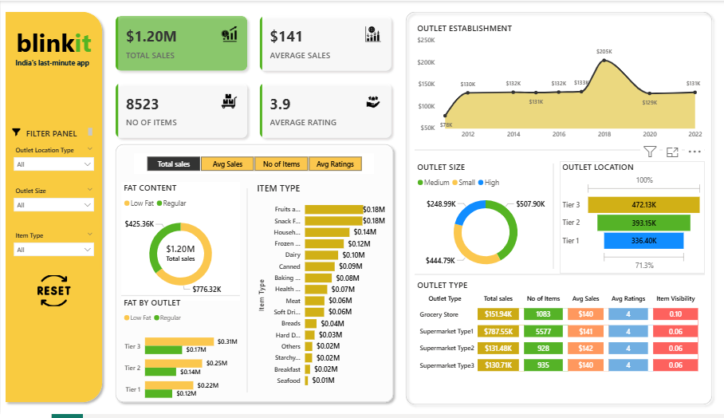

# Blinkit Quick-Commerce Analytics: Outlet & Product Trends

This project focuses on analyzing Blinkit’s sales data and building an interactive dashboard to uncover outlet-level performance and product-level sales trends in India’s quick-commerce sector.

## 📊 Project Overview
The dashboard highlights KPIs, product sales, and outlet-based performance. Its goal is to turn raw sales data into actionable insights that support channel and product strategy decision-making.

## 🔧 Tools & Technologies
- Power BI   
- Excel  

## 🔍 Key Insights
- Regular Fat products generated **$776K+** in sales, emerging as a top-selling category.  
- **Tier 3 outlets** contributed **$472K+** in sales, showing strong regional performance.  
- **Supermarket Type 1** accounted for **65%+** of sales, making it a key sales channel.  

## 🖼 Dashboard Snapshots
Here are sample previews of the dashboard (see the `Snapshot/` folder for all images):

  
*Overall sales and KPI performance*

## 🚀 Next Steps
Currently, the project covers dashboard development and visualization.  
The next phase will extend into an end-to-end pipeline using **Python and SQL** for:  
- Data extraction and cleaning   
- Deeper customer and sales trend analysis  

## 📂 Repository Contents
- `Dashboard/` → Power BI (.pbix) dashboard file 
- `Snapshots/` → Screenshot of dashboards for a quick preview  
- `README.md` → Project overview, insights, and roadmap  

---

## 👨‍💻 Author
**Chetan Chavan**  
Aspiring Data Analyst | Python & Visualization Enthusiast  
🔗 [LinkedIn](https://www.linkedin.com/in/chetanchvn02/) • 🌐 [Github](https://github.com/Chetanchvn02)

⭐ *If you find this project helpful, feel free to star the repo!*
